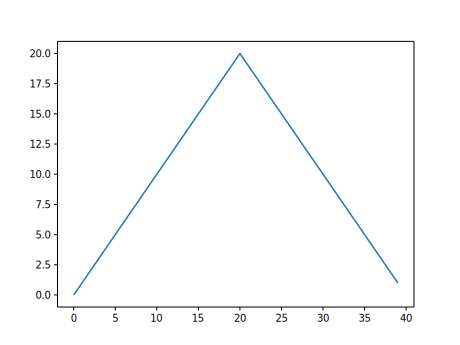
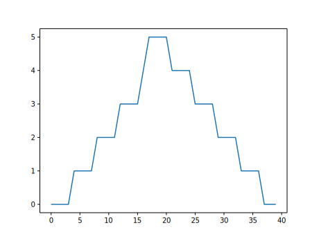
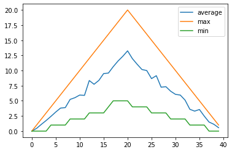

The mathematician Richard Hamming once said, "The purpose of computing is insight, not numbers," and
the best way to develop insight is often to visualize data.  Visualization deserves an entire
lecture of its own, but we can explore a few features of Python's `matplotlib` library here.  While
there is no official plotting library, `matplotlib` is the _de facto_ standard.

## Introduction to Matplotlib (and NumPy)

If you haven't already seen it, see topic [video lecture](FIXME), and [PowerPoint slides](../slides/2.2-Intro-NumPy-Matplotlib.pptx) used with per-slide notes.

## Adding Matplotlib to our Virtual Environment

Similarly to installing NumPy, we also need to install the Matplotlib external library to use it. If we need to reactivate our virtual environment we can do:

~~~
cd
cd 2020-se-day2/code
source venv/bin/activate
~~~
{: .language-bash}

And then, to install the package:

~~~
pip3 install matplotlib
~~~
{: .language-bash}

Matplotlib makes use of a *renderer* to allow us to view generated graphs and plots as images. The default renderer ('agg') isn't really suitable for this, so we need to install another one via the Ubuntu operating system's package manager:

~~~
sudo apt-get install python3-tk
~~~
{: .language-bash}

You'll be asked for the  `sabsr3` user's password - once entered, the package will be installed.

## Visualising our Inflammation Data

First, we will import the `pyplot` module from `matplotlib` and use two of its functions to create and display a heat map of our data (you won't need the line beginning `data =` if you're continuing directly after the previous lesson and already have it loaded):

~~~
import matplotlib.pyplot

data = numpy.loadtxt(fname='../data/inflammation-01.csv', delimiter=',')
image = matplotlib.pyplot.imshow(data)
matplotlib.pyplot.show()
~~~
{: .language-python}

Blue pixels in this heat map represent low values, while yellow pixels represent high values. As we can see, inflammation rises and falls over a 40-day period.

When we close the generated graph, note that running `matplotlib.pyplot.show()` again doesn't show us the graph. This odd behaviour comes back to Matplotlib's hidden state and is a design decision: `show()` represents the end of expected the graph creation process and is only intended to be used once. So annoyingly, in order to display it again we'd need to recreate the graph.

Let's take a look at the average inflammation over time:

~~~
ave_inflammation = numpy.mean(data, axis=0)
ave_plot = matplotlib.pyplot.plot(ave_inflammation)
matplotlib.pyplot.show()
~~~
{: .language-python}

Here, we have put the average per day across all patients in the variable `ave_inflammation`, then asked `matplotlib.pyplot` to create and display a line graph of those values.  The result is a roughly linear rise and fall, which is suspicious: we might instead expect a sharper rise and slower fall.  Let's have a look at two other statistics:

~~~
max_plot = matplotlib.pyplot.plot(numpy.max(data, axis=0))
matplotlib.pyplot.show()
~~~
{: .language-python}

~~~
min_plot = matplotlib.pyplot.plot(numpy.min(data, axis=0))
matplotlib.pyplot.show()
~~~
{: .language-python}

The maximum value rises and falls smoothly, while the minimum seems to be a step function. Neither trend seems particularly likely, so either there's a mistake in our calculations or something is wrong with our data. This insight would have been difficult to reach by examining the numbers themselves without visualization tools.

> ## Make Your Own Plot
>
> Create a plot showing the standard deviation (using `numpy.std`)
> of the inflammation data for each day across all patients.
>
> > ## Solution
> > ~~~
> > std_plot = matplotlib.pyplot.plot(numpy.std(data, axis=0))
> > matplotlib.pyplot.show()
> > ~~~
> > {: .language-python}
> {: .solution}
{: .challenge}

## Multiple Plots: Single Graph

Perhaps we want to compare the minimum, maximum, and average plots overlayed together. This would allow us to see the range of values across each day in the trial. Let's use PyCharm to build a script called `overlay_graphs.py` that positions our three graphs in a single plot, or 'figure'.

So Matplotlib divides a figure object up into axes: each pair of axes is one 'subplot'. To make a boring figure with just one pair of axes, however, we can just ask for a default new figure, with brand new axes. The `subplots()` function returns a (figure, axis) pair, which we can deal out with parallel assignment.

Given we have a stacked set of graphs in a single figure, we use `legend()` on our axes to add one which uses our given plot labels.

~~~
import numpy
import matplotlib.pyplot

data = numpy.loadtxt(fname='../data/inflammation-01.csv', delimiter=',')

all_graphs, all_graphs_axes = matplotlib.pyplot.subplots()

all_graphs_axes.plot(numpy.mean(data, axis=0), label='average')
all_graphs_axes.plot(numpy.max(data, axis=0), label='max')
all_graphs_axes.plot(numpy.min(data, axis=0), label='min')
all_graphs_axes.legend()

matplotlib.pyplot.show()
~~~
{: .language-python}

## Multiple Plots: Multiple Graphs

We can also group similar plots within a single figure using subplots next to each other within that figure. Let's use PyCharm to build another script called `multiple_graphs.py` that positions our three graphs side-by-side and introduces a number of new commands.

The function `matplotlib.pyplot.figure()` creates a space into which we will place all of our plots. The parameter `figsize` tells Python how big to make this space.

Each subplot is placed into the figure using its `add_subplot` method. The `add_subplot` method takes 3 parameters. The first denotes how many total rows of subplots there are, the second parameter refers to the total number of subplot columns, and the final parameter denotes which subplot your variable is referencing (left-to-right, top-to-bottom).

Each subplot is stored in a different variable (`axes1`, `axes2`, `axes3`). Once a subplot is created, the axes can be titled using the `set_xlabel()` command (or `set_ylabel()`).

~~~
import numpy
import matplotlib.pyplot

data = numpy.loadtxt(fname='../data/inflammation-01.csv', delimiter=',')

fig = matplotlib.pyplot.figure(figsize=(10.0, 3.0))

avg_axes = fig.add_subplot(1, 3, 1)
max_axes = fig.add_subplot(1, 3, 2)
min_axes = fig.add_subplot(1, 3, 3)

avg_axes.set_ylabel('average')
avg_axes.plot(numpy.mean(data, axis=0))

max_axes.set_ylabel('max')
max_axes.plot(numpy.max(data, axis=0))

min_axes.set_ylabel('min')
min_axes.plot(numpy.min(data, axis=0))

fig.tight_layout()

matplotlib.pyplot.show()
~~~
{: .language-python}

The call to `loadtxt` reads our data, and the rest of the program tells the plotting library how large we want the figure to be, that we're creating three subplots, what to draw for each one, and that we want a tight layout. (If we leave out that call to `fig.tight_layout()`, the graphs will actually be squeezed together more closely.)

> ## Moving Plots Around
>
> Save a new version of the program which displays the three plots vertically instead of horizontally.
>
> > ## Solution
> > ~~~
> > import numpy
> > import matplotlib.pyplot
> >
> > data = numpy.loadtxt(fname='../data/inflammation-01.csv', delimiter=',')
> >
> > # change figsize (swap width and height)
> > fig = matplotlib.pyplot.figure(figsize=(3.0, 10.0))
> >
> > # change add_subplot (swap first two parameters)
> > avg_axes = fig.add_subplot(3, 1, 1)
> > max_axes = fig.add_subplot(3, 1, 2)
> > min_axes = fig.add_subplot(3, 1, 3)
> >
> > avg_axes.set_ylabel('average')
> > avg_axes.plot(numpy.mean(data, axis=0))
> >
> > max_axes.set_ylabel('max')
> > max_axes.plot(numpy.max(data, axis=0))
> >
> > min_axes.set_ylabel('min')
> > min_axes.plot(numpy.min(data, axis=0))
> >
> > fig.tight_layout()
> >
> > matplotlib.pyplot.show()
> > ~~~
> > {: .language-python}
> {: .solution}
{: .challenge}

## Saving our Plots

We can also save our plots to disk. Let's change our `overlay_graphs.py` script to do that, by adding the following just before we call `matplotlib.pyplot.show()`:

~~~
all_graphs.savefig('overlay_graphs.png')
~~~
{: .language-python}

When we re-run the script, you should see a new `overlay_graphs.png` file in the same directory as the script. If we want to view this image, we can use an image tool called Eye of Gnome which is an Ubuntu default image viewer. To view the image, start a new terminal, change to the directory where this image is located, and then run:

~~~
eog overlay_graphs.png
~~~
{: .language-bash}

## Dealing with Multiple Datasets

We also have other inflammation datasets, located in the `data` directory. Let's try to generate and save visualisations for each of these datasets so we can compare them against each other, to increase our confidence that we have sensible datasets.

First, we need to have a way of determining a list of all our inflammation data files. Their filenames all follow the pattern `inflammation-XX.csv`, where `XX` refers to the number of that dataset. We can use the `glob` library here to help us get these filenames.

The glob library contains a function, also called glob, that finds files and directories whose names match a pattern. We provide those patterns as strings: the character `*` matches zero or more characters, while `?` matches any one character. We can use this to get the names of all the CSV files in the `data` directory which resides in the directory above like so:

~~~
import glob
filenames = sorted(glob.glob('inflammation*.csv'))
print(filenames)
~~~
{: .language-python}

Now, `glob()` returns a list of matching filenames (and directory paths) in arbitrary order, so we use the inbuilt `sorted()` Python function to sort this for us:

~~~
['../data/inflammation-01.csv', '../data/inflammation-02.csv', '../data/inflammation-03.csv', '../data/inflammation-04.csv', '../data/inflammation-05.csv', '../data/inflammation-06.csv', '../data/inflammation-07.csv', '../data/inflammation-08.csv', '../data/inflammation-09.csv', '../data/inflammation-10.csv', '../data/inflammation-11.csv', '../data/inflammation-12.csv']
~~~
{: .output}

This means we can loop over it to do something with each filename in turn.

We'd like to save each of the generated plots using the pattern `inflammation-XX.png`. Each of the filenames we have in `filenames` has a `.csv.` on the end. So how to go about replacing the file extension with a `.png` one? We can use the `os` library to extract the file path for us, e.g.

~~~
import os

filename = '../data/inflammation-01.csv'
base = os.path.splitext(filename)[0]
new_filename = base + '.png'
print(new_filename)
~~~
{: .language-python}

`os.path.splitext()` splits a filename into its path/filename, and file extension components. So we just append the `.png` extension to the path/filename part, and get:

~~~
'../data/inflammation-01.png'
~~~
{: .output}

> ## Processing Multiple Inflammation Datasets
>
> Modify our script that generates the three horizontal graphs in a single figure (`multiple_graphs.py`) so that it processes each of the inflammation datasets in turn (each with a filename of the form `inflammation-XX.csv`), generating the figure for each, and saving it to local disk as a PNG file with a filename of the form `inflammation-XX.png`.
>
> > ## Solution
> > ~~~
> > import glob
> > import numpy
> > import matplotlib.pyplot
> >
> > filenames = sorted(glob.glob('../data/inflammation*.csv'))
> > for f in filenames:
> >     data = numpy.loadtxt(fname=f, delimiter=',')
> >
> >     fig = matplotlib.pyplot.figure(figsize=(10.0, 3.0))
> >
> >     avg_axes = fig.add_subplot(1, 3, 1)
> >     max_axes = fig.add_subplot(1, 3, 2)
> >     min_axes = fig.add_subplot(1, 3, 3)
> >
> >     avg_axes.set_ylabel('average')
> >     avg_axes.plot(numpy.mean(data, axis=0))
> >
> >     max_axes.set_ylabel('max')
> >     max_axes.plot(numpy.max(data, axis=0))
> >
> >     min_axes.set_ylabel('min')
> >     min_axes.plot(numpy.min(data, axis=0))
> >
> >     fig.tight_layout()
> >     fig.savefig(f + '.png')
> > ~~~
> > {: .language-python}
> {: .solution}
>
> Refactor your graph generation code within a new function named `generate_graph()` that takes a NumPy array as an argument, generates the figure from the input data, and returns the generated figure. Use this function within your loop instead.
>
> > ## Solution
> > ~~~
> > import glob
> > import numpy
> > import matplotlib.pyplot
> >
> > def generate_graph(data):
> >     fig = matplotlib.pyplot.figure(figsize=(10.0, 3.0))
> >
> >     avg_axes = fig.add_subplot(1, 3, 1)
> >     max_axes = fig.add_subplot(1, 3, 2)
> >     min_axes = fig.add_subplot(1, 3, 3)
> >
> >     avg_axes.set_ylabel('average')
> >     avg_axes.plot(numpy.mean(data, axis=0))
> >
> >     max_axes.set_ylabel('max')
> >     max_axes.plot(numpy.max(data, axis=0))
> >
> >     min_axes.set_ylabel('min')
> >     min_axes.plot(numpy.min(data, axis=0))
> >
> >     fig.tight_layout()
> >
> >     return fig
> >
> > filenames = sorted(glob.glob('../data/inflammation*.csv'))
> > for f in filenames:
> >     data = numpy.loadtxt(fname=f, delimiter=',')
> >
> >     figure = generate_graph(data)
> >
> >     figure.savefig(f + '.png')
> > ~~~
> > {: .language-python}
> {: .solution}
{: .challenge}


